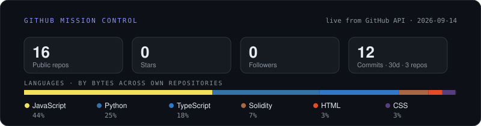

<!-- ANJALI.SYS — engineering profile. Visuals are generated SVGs in /assets; live data blocks are refreshed by GitHub Actions. -->

<picture>
  <source media="(prefers-color-scheme: dark)" srcset="assets/boot-dark.svg">
  <source media="(prefers-color-scheme: light)" srcset="assets/boot-light.svg">
  
</picture>

<p align="center">
  <a href="https://anjali-portfolio-hazel.vercel.app"><b>PORTFOLIO</b></a>&nbsp;&nbsp;&nbsp;·&nbsp;&nbsp;&nbsp;
  <a href="https://www.linkedin.com/in/anjali-sehrawat-2a1a68357/"><b>LINKEDIN</b></a>&nbsp;&nbsp;&nbsp;·&nbsp;&nbsp;&nbsp;
  <a href="https://github.com/Anjalisehrawat007?tab=repositories"><b>GITHUB</b></a>&nbsp;&nbsp;&nbsp;·&nbsp;&nbsp;&nbsp;
  <a href="mailto:anjalisehrawat296@gmail.com"><b>EMAIL</b></a>
</p>

<p align="center"><sub>SOFTWARE ENGINEER &nbsp;·&nbsp; AI / ML &nbsp;·&nbsp; FULL-STACK &nbsp;·&nbsp; VIT, B.Tech CSE (CGPA 8.65)</sub></p>

> I build intelligent, end-to-end software systems — from BioBERT and CNN-based medical screening to a self-sovereign identity platform on Ethereum — and take ML-powered products from model to deployment with Python, PyTorch, Hugging Face, MERN and FastAPI.

<br>

## ⚙️ System Capabilities

<table>
<tr>
<td valign="top" width="33%">

`AI / MACHINE LEARNING`

**Computer vision** — MediaPipe pose, CNNs<br>
**NLP** — BioBERT, HuggingFace Transformers<br>
**Deep learning** — LSTMs for time series<br>
**Model serving** — Flask, Hugging Face<br>
**Tooling** — PyTorch, Scikit-learn

</td>
<td valign="top" width="33%">

`SOFTWARE ENGINEERING`

**Backend APIs** — FastAPI, Flask<br>
**Full-stack apps** — MERN, Next.js, Tailwind<br>
**Authentication** — WebAuthn<br>
**Decentralised trust** — Ethereum, IPFS, Merkle proofs, ZK<br>
**Data systems** — SQL, Tableau

</td>
<td valign="top" width="33%">

`DEPLOYMENT`

**Containers** — Docker<br>
**Cloud** — AWS / GCP<br>
**Live systems** — Vercel, Ethereum Sepolia<br>
**Foundations** — DSA, OOP, OS, networks, compilers<br>
**Version control** — Git

</td>
</tr>
</table>

<br>

## 🗺️ Engineering Map

How technology becomes engineering becomes shipped systems. Animated edges are the paths that reached production.

<picture>
  <source media="(prefers-color-scheme: dark)" srcset="assets/engineering-map-dark.svg">
  <source media="(prefers-color-scheme: light)" srcset="assets/engineering-map-light.svg">
  
</picture>

<br>

## 🪐 Project Constellation

<picture>
  <source media="(prefers-color-scheme: dark)" srcset="assets/constellation-dark.svg">
  <source media="(prefers-color-scheme: light)" srcset="assets/constellation-light.svg">
  
</picture>

<br>

## 🚀 Engineering Portfolio

<table>
<tr>
<td valign="top" width="50%">

### SIGIL
**Self-sovereign identity** &nbsp;·&nbsp; 🟢 `STATUS: LIVE DEMO` &nbsp; 🔒 `REPO: PRIVATE`

Holder-controlled credentials with secure issuance, verification and selective disclosure. A batch of credentials is committed as **one Merkle root** to an Ethereum trust layer; **zero-knowledge age proofs** answer "over 18?" without revealing a birth date; **M-of-N guardian recovery** restores access with no central authority. Deployed on Ethereum Sepolia.

<sub><code>Identity · WebAuthn</code> → <code>Issuance</code> → <code>IPFS</code> → <code>Merkle root</code> → <code>Ethereum trust layer</code> → <code>Verification</code> → <code>Selective disclosure / ZK proof</code></sub>

`Next.js` `Ethereum` `IPFS` `WebAuthn` `Merkle trees` `ZK proofs`

**[ ▶ LIVE DEMO ](https://sigil-ssi-web.vercel.app/)** &nbsp; [Case study →](https://anjali-portfolio-hazel.vercel.app/projects/sigil)

</td>
<td valign="top" width="50%">

### SHOULDERMOTION AI
**Clinical motion analysis** &nbsp;·&nbsp; 🟢 `STATUS: LIVE` &nbsp; 🔗 `REPO: PUBLIC`

Markerless 3D motion analysis that automates postoperative shoulder assessment from ordinary cameras — no lab equipment. Two purpose-built measures, the **Adaptive Shoulder Recovery Index (ASRI)** and the **Dynamic Movement Quality Engine (DMQE)**, produce explainable rehabilitation analytics that support clinical decision-making.

<sub><code>Movement input</code> → <code>MediaPipe pose</code> → <code>Motion analysis · FastAPI</code> → <code>ASRI + DMQE</code> → <code>Explainable rehab analytics</code></sub>

`Flutter` `FastAPI` `MediaPipe` `Python`

**[ ▶ LIVE DEMO ](https://shoulder-rom-app.vercel.app/)** &nbsp; **[ GitHub ](https://github.com/Anjalisehrawat007/shoulder-rom-app)** &nbsp; [Case study →](https://anjali-portfolio-hazel.vercel.app/projects/shouldermotion-ai)

</td>
</tr>
<tr>
<td valign="top" width="50%">

### POWER GRID FAILURE PREDICTION
**Deep learning for infrastructure** &nbsp;·&nbsp; 🔗 `STATUS: REPOSITORY` &nbsp; `REPO: PUBLIC`

LSTM-based predictive maintenance over **multivariate sensor streams** — weather, demand and transformer temperature — trained to detect anomalous failure signatures in real-time data and raise early failure predictions before a blackout. Evaluated at 10% precision/recall in early failure detection.

<sub><code>Sensor streams · weather / demand / transformer temp</code> → <code>Multivariate sequence</code> → <code>LSTM</code> → <code>Failure-pattern detection</code> → <code>Early prediction</code></sub>

`LSTM` `Deep learning` `Time series`

**[ GitHub ](https://github.com/Anjalisehrawat007/Predicting-Power-Grid-Failures-with-Deep-Learning)** &nbsp; [Case study →](https://anjali-portfolio-hazel.vercel.app/projects/power-grid-failure-prediction)

</td>
<td valign="top" width="50%">

### RARECARE
**AI assistant for rare & stigma-associated diseases** &nbsp;·&nbsp; 🚧 `STATUS: IN DEVELOPMENT`

Two modality-specific pipelines — text (**BioBERT**) and image (**CNNs trained on MedMNIST**) — converging on a single AI-assistance layer for conditions where people are least likely to seek early assessment. Being extended toward early screening of stigma-related cancers; served via Flask and Hugging Face.

<sub><code>Symptoms</code> → <code>BioBERT</code> → <code>Symptom analysis</code> &nbsp;+&nbsp; <code>Medical scan</code> → <code>CNN · MedMNIST</code> → <code>Screening</code> ⇒ <code>AI assistance · Flask / Hugging Face</code></sub>

`BioBERT` `CNN` `MedMNIST` `Flask` `Hugging Face`

[Case study →](https://anjali-portfolio-hazel.vercel.app/projects/rarecare)

</td>
</tr>
</table>

<sub>Each case study on the <a href="https://anjali-portfolio-hazel.vercel.app/#projects">portfolio</a> has an interactive architecture diagram — click a component to see what it does, why it exists and the technology behind it.</sub>

<br>

## ⚡ GitHub Mission Control

<picture>
  <source media="(prefers-color-scheme: dark)" srcset="assets/stats-dark.svg">
  <source media="(prefers-color-scheme: light)" srcset="assets/stats-light.svg">
  
</picture>

<!-- ACTIVITY:START -->
```text
TOP LANGUAGES · by bytes across own repos
──────────────────────────────────────────
JavaScript   █████████░░░░░░░░░░░ 44%
Python       █████░░░░░░░░░░░░░░░ 25%
TypeScript   ████░░░░░░░░░░░░░░░░ 18%
Solidity     █░░░░░░░░░░░░░░░░░░░  7%
HTML         █░░░░░░░░░░░░░░░░░░░  3%
CSS          █░░░░░░░░░░░░░░░░░░░  3%

RECENT ACTIVITY
──────────────────────────────────────────
anjali-portfolio               6d ago
Predicting-Power-Grid-Failures 7d ago
trustmesh                      14d ago
shoulder-rom-app               1mo ago
ATTEST-FL                      1mo ago
```
| Repository | Language | Last push |
|---|---|---|
| [anjali-portfolio](https://github.com/Anjalisehrawat007/anjali-portfolio) | TypeScript | 6d ago |
| [Predicting-Power-Grid-Failures-with-Deep-Learning](https://github.com/Anjalisehrawat007/Predicting-Power-Grid-Failures-with-Deep-Learning) | — | 7d ago |
| [trustmesh](https://github.com/Anjalisehrawat007/trustmesh) | — | 14d ago |
| [shoulder-rom-app](https://github.com/Anjalisehrawat007/shoulder-rom-app) | JavaScript | 1mo ago |
| [ATTEST-FL](https://github.com/Anjalisehrawat007/ATTEST-FL) | Python | 1mo ago |

<sub>Auto-updated 2026-09-21 from the GitHub API · 17 public repos · 0 stars · 12 commits pushed in the last 30 days across 3 repos</sub>
<!-- ACTIVITY:END -->

### Contribution Activity

<picture>
  <source media="(prefers-color-scheme: dark)" srcset="https://raw.githubusercontent.com/Anjalisehrawat007/Anjalisehrawat007/output/snake-dark.svg">
  <source media="(prefers-color-scheme: light)" srcset="https://raw.githubusercontent.com/Anjalisehrawat007/Anjalisehrawat007/output/snake-light.svg">
  
</picture>

<sub>Everything in Mission Control is generated from the GitHub API by <a href=".github/workflows/profile.yml">a scheduled Action</a> (<a href="scripts/generate-profile.mjs">source</a>) — no third-party stat services, no hand-written numbers.</sub>

<br>

## 🧭 Engineering Journey

```text
2023 ─┬─ B.Tech CSE · VIT (CGPA 8.65)
      ├─ All India Rank 47 · VITEEE
      └─ Core team · E-Cell hackathon (500+)
      │
2024 ─┬─ ShoulderMotion AI · clinical motion analysis
      └─ Core Committee · VITMAS Technical Team
      │
2025 ─┬─ Data Science Intern · Zidio Development
      ├─ Power Grid Failure Prediction · LSTM
      └─ Oracle Certified Foundation Associate
      │
2026 ─┬─ Software Engineer · Ayuka Developers
      │    turnaround −10% · load time −15%
      ├─ Sigil · self-sovereign identity · Sepolia
      ├─ IBM Agentic AI Professional
      └─ RareCare · in development  ◀ now
```

<br>

## 🔨 Current Build

<!-- NOW:START -->
| Field | Status |
|---|---|
| **Current build** | RareCare — AI assistant for rare & stigma-associated diseases · 🚧 in development |
| **Latest push** | [anjali-portfolio](https://github.com/Anjalisehrawat007/anjali-portfolio) · 6d ago |
| **30-day throughput** | 12 commits · 3 active repos |
| **Profile refreshed** | 2026-09-21 (every 6h via GitHub Actions) |
<!-- NOW:END -->

<br>

## 📡 Signals

<table>
<tr>
<td valign="top" width="50%">

`EXPERIENCE`

**Software Engineer — Ayuka Developers** · May – Jul 2026<br>
Scalable, user-focused software; turnaround time −**10%**, load time −**15%** via targeted debugging and testing.

**Data Science Intern — Zidio Development** · Jun – Jul 2025<br>
SQL + Python analysis informing decisions across **10** cross-functional teams; automated Tableau dashboards cut manual reporting time by **15%**.

</td>
<td valign="top" width="50%">

`ACHIEVEMENTS`

▸ **All India Rank 47** — VITEEE 2023<br>
▸ **Core Committee Member** — Technical Team, VITMAS Club (2024 – 2025)<br>
▸ **Core Team Member** — E-Cell Inter-College Hackathon (2023 – 2024) · **500+** participants

`CERTIFICATIONS`

▸ Oracle Certified Foundation Associate — Sep 2025<br>
▸ IBM Agentic AI Professional — Jul 2026

</td>
</tr>
</table>

<br>

---

<p align="center">
  <sub>ANJALI.SYS &nbsp;·&nbsp; SYSTEM STATUS: ONLINE &nbsp;·&nbsp; OPEN TO SOFTWARE ENGINEERING &amp; AI/ML ROLES</sub><br><br>
  <a href="https://anjali-portfolio-hazel.vercel.app"><b>PORTFOLIO</b></a>&nbsp;&nbsp;&nbsp;·&nbsp;&nbsp;&nbsp;
  <a href="https://www.linkedin.com/in/anjali-sehrawat-2a1a68357/"><b>LINKEDIN</b></a>&nbsp;&nbsp;&nbsp;·&nbsp;&nbsp;&nbsp;
  <a href="https://github.com/Anjalisehrawat007"><b>GITHUB</b></a>&nbsp;&nbsp;&nbsp;·&nbsp;&nbsp;&nbsp;
  <a href="mailto:anjalisehrawat296@gmail.com"><b>EMAIL</b></a>
</p>
