<picture>
  <source media="(prefers-color-scheme: dark)" srcset="assets/hero-dark.svg">
  <source media="(prefers-color-scheme: light)" srcset="assets/hero-light.svg">
  
</picture>

<p align="center">
  <a href="https://anjali-portfolio-hazel.vercel.app"><b>Portfolio</b></a>&nbsp;&nbsp;·&nbsp;&nbsp;
  <a href="https://www.linkedin.com/in/anjali-sehrawat-2a1a68357/"><b>LinkedIn</b></a>&nbsp;&nbsp;·&nbsp;&nbsp;
  <a href="https://github.com/Anjalisehrawat007?tab=repositories"><b>GitHub</b></a>&nbsp;&nbsp;·&nbsp;&nbsp;
  <a href="#-featured-engineering"><b>Projects</b></a>&nbsp;&nbsp;·&nbsp;&nbsp;
  <a href="mailto:anjalisehrawat296@gmail.com"><b>Contact</b></a>
</p>

Software engineer working across **AI/ML and full-stack engineering** — from BioBERT and CNN-based medical screening to a self-sovereign identity platform on Ethereum. I take ML-powered products from model to deployment with Python, PyTorch, Hugging Face, MERN and FastAPI, grounded in data structures, algorithms and systems fundamentals.

<br>

## ⚡ Engineering Activity

<picture>
  <source media="(prefers-color-scheme: dark)" srcset="assets/stats-dark.svg">
  <source media="(prefers-color-scheme: light)" srcset="assets/stats-light.svg">
  
</picture>

<picture>
  <source media="(prefers-color-scheme: dark)" srcset="https://raw.githubusercontent.com/Anjalisehrawat007/Anjalisehrawat007/output/snake-dark.svg">
  <source media="(prefers-color-scheme: light)" srcset="https://raw.githubusercontent.com/Anjalisehrawat007/Anjalisehrawat007/output/snake-light.svg">
  
</picture>

<!-- ACTIVITY:START -->
| Repository | Language | Last push |
|---|---|---|
| [anjali-portfolio](https://github.com/Anjalisehrawat007/anjali-portfolio) | TypeScript | today |
| [Predicting-Power-Grid-Failures-with-Deep-Learning](https://github.com/Anjalisehrawat007/Predicting-Power-Grid-Failures-with-Deep-Learning) | — | today |
| [trustmesh](https://github.com/Anjalisehrawat007/trustmesh) | — | 7d ago |
| [shoulder-rom-app](https://github.com/Anjalisehrawat007/shoulder-rom-app) | JavaScript | 1mo ago |
| [ATTEST-FL](https://github.com/Anjalisehrawat007/ATTEST-FL) | Python | 1mo ago |

<sub>Auto-updated 2026-09-14 from the GitHub API · 16 public repos · 10 commits pushed in the last 30 days</sub>
<!-- ACTIVITY:END -->

<sub>The cards above are regenerated every 6 hours by a GitHub Action from the GitHub API — nothing is hand-written. Source: <a href="scripts/generate-profile.mjs">scripts/generate-profile.mjs</a>.</sub>

<br>

## What I Build

<table>
<tr>
<td valign="top" width="33%">

**AI / ML systems**

→ Applied ML in healthcare<br>
→ Computer vision (MediaPipe, CNNs)<br>
→ NLP (BioBERT, Transformers)<br>
→ Deep learning for time series (LSTM)<br>
→ Model serving (Flask, Hugging Face)

</td>
<td valign="top" width="33%">

**Software systems**

→ Backend APIs (FastAPI, Flask)<br>
→ Full-stack apps (MERN, Next.js)<br>
→ Authentication (WebAuthn)<br>
→ Decentralised trust (Ethereum, IPFS, Merkle proofs, ZK)<br>
→ System design on solid CS fundamentals

</td>
<td valign="top" width="33%">

**Product engineering**

→ Deployed applications (Vercel, Sepolia)<br>
→ Cloud & containers (Docker, AWS/GCP)<br>
→ Data-driven decisions (SQL, Tableau)<br>
→ Performance work — measured, not guessed<br>
→ Explainable outputs for real users

</td>
</tr>
</table>

<br>

## 🚀 Featured Engineering

<table>
<tr>
<td valign="top" width="50%">

### Sigil — Self-Sovereign Identity
🟢 **Live demo** &nbsp; 🔒 Repository not public

Holder-controlled digital credentials with secure issuance, verification and selective disclosure. A batch of credentials is committed as **one Merkle root** to an Ethereum trust layer; **zero-knowledge age proofs** answer "over 18?" without revealing a birth date; **M-of-N guardian recovery** restores access with no central authority. Deployed on Ethereum Sepolia.

`Next.js` `Ethereum` `IPFS` `WebAuthn` `Merkle trees` `ZK proofs`

**[▶ Live Demo →](https://sigil-ssi-web.vercel.app/)** &nbsp;·&nbsp; [Case study](https://anjali-portfolio-hazel.vercel.app/projects/sigil)

</td>
<td valign="top" width="50%">

### ShoulderMotion AI
🟢 **Live** &nbsp; 🔗 **Open source**

Markerless 3D clinical motion analysis that automates postoperative shoulder assessment from ordinary cameras. Introduces two purpose-built measures — the **Adaptive Shoulder Recovery Index (ASRI)** and the **Dynamic Movement Quality Engine (DMQE)** — for explainable rehabilitation analytics that support clinical decision-making.

`Flutter` `FastAPI` `MediaPipe` `Python`

**[▶ Live Demo →](https://shoulder-rom-app.vercel.app/)** &nbsp;·&nbsp; [GitHub](https://github.com/Anjalisehrawat007/shoulder-rom-app) &nbsp;·&nbsp; [Case study](https://anjali-portfolio-hazel.vercel.app/projects/shouldermotion-ai)

</td>
</tr>
<tr>
<td valign="top" width="50%">

### Predicting Power Grid Failures with Deep Learning
🔗 **Repository**

LSTM-based predictive maintenance over **multivariate sensor streams** — weather, demand and transformer temperature — trained to detect anomalous failure signatures in real-time data and raise early failure predictions before a blackout. Evaluated at 10% precision/recall in early failure detection.

`LSTM` `Deep learning` `Time series`

[GitHub →](https://github.com/Anjalisehrawat007/Predicting-Power-Grid-Failures-with-Deep-Learning) &nbsp;·&nbsp; [Case study](https://anjali-portfolio-hazel.vercel.app/projects/power-grid-failure-prediction)

</td>
<td valign="top" width="50%">

### RareCare — AI Assistant for Rare & Stigma-Associated Diseases
🚧 **Ongoing**

Two modality-specific pipelines — text (**BioBERT**) and image (**CNNs trained on MedMNIST**) — converging on a single AI-assistance layer for conditions where people are least likely to seek early assessment. Being extended toward early screening of stigma-related cancers; served via Flask and Hugging Face.

`BioBERT` `CNN` `MedMNIST` `Flask` `Hugging Face`

[Case study](https://anjali-portfolio-hazel.vercel.app/projects/rarecare)

</td>
</tr>
</table>

<sub>Every project on the <a href="https://anjali-portfolio-hazel.vercel.app/#projects">portfolio</a> has an interactive architecture diagram — click a component to see what it does, why it exists and the technology behind it.</sub>

<br>

## 🧰 Engineering Stack

How the technologies map to the systems above:

```text
Python
├── RareCare                 BioBERT · CNN (MedMNIST) · Flask
├── ShoulderMotion AI        FastAPI backend
└── Power Grid Prediction    LSTM on multivariate sensor streams

PyTorch · HuggingFace Transformers
└── RareCare                 BioBERT symptom analysis · Hugging Face inference

FastAPI · Flask
├── ShoulderMotion AI        motion-analysis API
└── RareCare                 model serving

MediaPipe · Flutter
└── ShoulderMotion AI        markerless pose capture → ASRI + DMQE

Next.js · Ethereum · IPFS · WebAuthn
└── Sigil                    credential issuance → Merkle root → Sepolia trust layer → ZK proofs

SQL · Python · Tableau
└── Zidio Development        analysis across 10 cross-functional teams
```

| Area | Technologies |
|---|---|
| **Languages** | Python · Java · C/C++ |
| **AI / ML** | PyTorch · HuggingFace Transformers · Scikit-learn · BioBERT · CNNs · LSTMs · MediaPipe |
| **Backend** | FastAPI · Flask · SQL |
| **Frontend** | Next.js · React (MERN) · HTML · CSS · Tailwind CSS |
| **Web3 / Security** | Ethereum · IPFS · WebAuthn · Merkle trees · Zero-knowledge proofs |
| **Cloud / DevOps** | Docker · AWS / GCP · Git |
| **Core CS** | Data Structures & Algorithms · OOP · Operating Systems · Computer Networks · Compiler Design |

<br>

## 🧭 Engineering Timeline

| Year | Milestones |
|---|---|
| **2023** | B.Tech CSE, Vellore Institute of Technology (CGPA 8.65) · **All India Rank 47**, VITEEE · Core team, E-Cell Inter-College Hackathon (500+ participants) |
| **2024** | **ShoulderMotion AI** — markerless clinical motion analysis · Core Committee, VITMAS Technical Team |
| **2025** | **Data Science Intern**, Zidio Development · **Power Grid Failure Prediction** (LSTM) · Oracle Certified Foundation Associate |
| **2026** | **Software Engineer**, Ayuka Developers — turnaround −10%, load time −15% · **Sigil** on Ethereum Sepolia · **RareCare** (ongoing) · IBM Agentic AI Professional |

<br>

## 📡 Signals

<table>
<tr>
<td valign="top" width="50%">

**Experience**

**Software Engineer — Ayuka Developers** · May – Jul 2026<br>
Scalable, user-focused software; turnaround time reduced by **10%**, load time improved by **15%** through targeted debugging and testing.

**Data Science Intern — Zidio Development** · Jun – Jul 2025<br>
SQL + Python analysis informing decisions across **10** cross-functional teams; automated Tableau dashboards cut manual reporting time by **15%**.

</td>
<td valign="top" width="50%">

**Achievements**

🏅 **All India Rank 47** — VITEEE 2023<br>
🛠️ **Core Committee Member** — Technical Team, VITMAS Club (2024 – 2025)<br>
🎪 **Core Team Member** — E-Cell Inter-College Hackathon (2023 – 2024), **500+** participants

**Certifications**

📜 Oracle Certified Foundation Associate — Sep 2025<br>
📜 IBM Agentic AI Professional — Jul 2026

</td>
</tr>
</table>

<br>

## 🔨 Now

**Currently building →** RareCare, an ongoing AI-assisted diagnostic system (BioBERT + MedMNIST CNNs) being extended toward early screening of stigma-related cancers.<br>
**Current focus →** applied AI/ML + software engineering — shipping end-to-end systems, not notebooks.<br>
**Open to →** software engineering and AI/ML roles.

<br>

---

<p align="center">
  <b>Building systems, learning continuously, and shipping useful software.</b><br><br>
  <a href="https://anjali-portfolio-hazel.vercel.app">Portfolio</a>&nbsp;&nbsp;·&nbsp;&nbsp;
  <a href="https://www.linkedin.com/in/anjali-sehrawat-2a1a68357/">LinkedIn</a>&nbsp;&nbsp;·&nbsp;&nbsp;
  <a href="https://github.com/Anjalisehrawat007">GitHub</a>&nbsp;&nbsp;·&nbsp;&nbsp;
  <a href="mailto:anjalisehrawat296@gmail.com">anjalisehrawat296@gmail.com</a>
</p>
